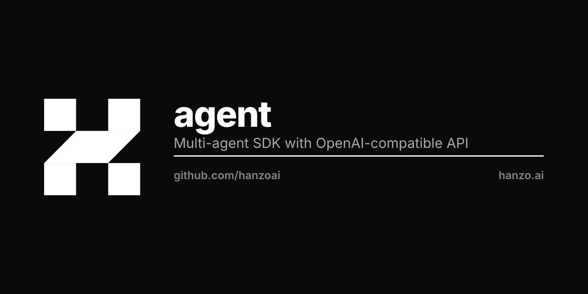

<p align="center"></p>

# Hanzo Agent SDK

`hanzo-agent` runs agents in Python. An agent is a model reached over an
OpenAI-compatible `/v1` API, its instructions, and the Python functions it may
call as tools. It installs as `hanzo-agent` and imports as `agents`.

## Install

Python 3.9 or newer.

```bash
pip install hanzo-agent
```

## First agent

```python
from openai import AsyncOpenAI
from agents import Agent, Runner, set_default_openai_api, set_default_openai_client

set_default_openai_client(AsyncOpenAI(base_url="http://localhost:11434/v1", api_key="ollama"))
set_default_openai_api("chat_completions")

agent = Agent(name="Assistant", instructions="You are a helpful assistant.", model="qwen3:0.6b")
result = Runner.run_sync(agent, "Write a haiku about recursion in programming.")
print(result.final_output)
```

One run printed:

```
Recursive function deferring calls,
A loop unrolled with grace,
Ends with a loop.
```

The two calls before the agent decide where it runs:

- `set_default_openai_client` names the endpoint and the key. Above it is a
  local server on port 11434, Ollama with `qwen3:0.6b` pulled. For the hosted
  API pass `base_url="https://api.hanzo.ai/v1"`, a Hanzo API key as `api_key`,
  and a model id from `https://api.hanzo.ai/v1/models`.
- `set_default_openai_api("chat_completions")` sends `POST /v1/chat/completions`.
  Without it the SDK sends `POST /v1/responses` instead.

## Tools

A decorated function becomes a tool the model can call:

```python
from agents import function_tool

@function_tool
def get_weather(city: str) -> str:
    return f"The weather in {city} is sunny."

agent = Agent(
    name="Weather",
    instructions="Answer with the get_weather tool.",
    tools=[get_weather],
    model="qwen3:0.6b",
)
print(Runner.run_sync(agent, "What is the weather in Tokyo?").final_output)
```

With the setup above it printed `The weather in Tokyo is sunny.`

## Errors and retries

Model calls go through the `openai` client and follow its rules. A 401, 402 or
403 raises on the first answer (`AuthenticationError`, `APIStatusError`,
`PermissionDeniedError`). A 429 or 5xx is retried twice and then raises;
`AsyncOpenAI(..., max_retries=0)` sends it once. A 200 whose body is an error
object raises `openai.APIError` carrying the server's message, as the client
does for an error inside a stream. A `<think>…</think>` block left in the reply
stays in `final_output`.

## Tracing

Runs create traces and spans and send them nowhere. To export them, add a
processor:

```python
from agents import add_trace_processor
from agents.tracing.processors import BackendSpanExporter, BatchTraceProcessor

exporter = BackendSpanExporter(endpoint="https://collector.example/ingest", api_key="...")
add_trace_processor(BatchTraceProcessor(exporter))
```

The exporter posts batches of JSON to that endpoint with the key as a bearer
token. `set_tracing_disabled(True)` or `OPENAI_AGENTS_DISABLE_TRACING=1` stops
creating them.

## Extras

```bash
pip install "hanzo-agent[web3]"   # agents.extensions.web3: AgentWallet, Web3Wallet, MpcClient
pip install "hanzo-agent[tee]"    # agents.extensions.tee: ConfidentialAgent, TEEProvider
```

`agents.network` routes a request among several agents and
`agents.orchestration` runs workflows over registered agents; both are in the
base package.

## This repository

The root is also a Go module, `github.com/hanzoai/agent`, and `sdk/` holds
Python, TypeScript and Go clients published under other names. This README
covers `hanzo-agent` only.

## Development

```bash
make sync    # uv sync --all-extras --all-packages --group dev
make tests   # uv run pytest
```
